# SQL-Banking-Project

A SQL Server banking database project demonstrating relational design, constraints, stored procedures, triggers, transaction processing, validation logic, and final test documentation.

# SmartBank SQL Server Database System

## Project Overview

SmartBank is a SQL Server database project designed to simulate a regional banking system. The system manages customers, customer contact numbers, bank accounts, and financial transactions while enforcing business rules through constraints, stored procedures, triggers, and validation logic.

This project was developed as a portfolio-ready database system to demonstrate practical SQL Server development skills, relational database design, data integrity enforcement, transaction processing, and technical documentation.

## Project Status

**Status:** Completed

Completed features:

- Created the `SmartBankDB` database
- Created and tested the `customer` table
- Created and tested the `contacts` table
- Created and tested the `account` table
- Created and tested the `account_transaction` table
- Added primary keys, foreign keys, check constraints, unique constraints, default constraints, and computed columns
- Created stored procedures for customer creation, account creation, and transaction processing
- Created a balance trigger to automatically update account balances after transactions
- Created a validation trigger to prevent transaction records from being updated or deleted
- Added final test cases for successful and failed operations
- Added screenshots documenting project behavior and test results
- Organized SQL scripts and documentation for GitHub

## Documentation

Additional project documentation is available in the `docs` folder:

| Document | Description |
| -------- | ----------- |
| [Business Rules](docs/business_rules.md) | Explains the customer, contact, account, transaction, stored procedure, and trigger rules enforced by the database |
| [Project Summary](docs/project_summary.md) | Provides a professional project summary for portfolio, resume, LinkedIn, Handshake, and interview use |

## Project Goals

The main goal of this project is to design and implement a relational database system that can:

- Store customer information
- Store customer phone numbers
- Manage bank accounts
- Process deposits, withdrawals, and transfers
- Prevent invalid or duplicate data
- Automatically maintain account balances
- Protect transaction history from unauthorized changes
- Demonstrate stored procedures, triggers, constraints, and testing scripts

## Tools and Technologies

- Microsoft SQL Server Developer Edition
- SQL Server Management Studio
- T-SQL
- GitHub
- GitHub Desktop

## Database Tables

| Table Name | Purpose |
| ---------- | ------- |
| `customer` | Stores customer identity, address, SSN, and customer type |
| `contacts` | Stores one or more phone numbers for each customer |
| `account` | Stores bank account information and balances |
| `account_transaction` | Stores deposit, withdrawal, and transfer activity |

## Table Summary

### `customer`

The `customer` table stores customer identity and address information.

Key features:

- Auto-generated customer ID
- Formatted customer code such as `0001`, `0002`, `0003`
- Required first name and last name
- Required date of birth
- Required SSN
- Required address information
- Customer type validation
- U.S. state abbreviation validation
- Duplicate customer prevention
- Unique SSN enforcement

### `contacts`

The `contacts` table stores customer phone numbers.

Key features:

- Supports multiple phone numbers per customer
- Uses a foreign key relationship to the `customer` table
- Stores phone numbers as raw digits
- Uses a computed column to display formatted phone numbers
- Prevents duplicate phone numbers for the same customer

### `account`

The `account` table stores bank account information.

Key features:

- Manual account number entry for testing and demonstration purposes
- Account type validation
- Default starting balance of `0.00`
- Foreign key relationship to the `customer` table
- Balance protection to prevent negative balances

Production note:

Account numbers are currently entered manually for testing and demonstration purposes. In a production banking system, account numbers would normally be generated through a controlled account-numbering process.

### `account_transaction`

The `account_transaction` table stores financial transaction activity.

Key features:

- Records deposits, withdrawals, and transfers
- Stores transaction amount, date, location, source account, and destination account
- Validates transaction type
- Validates transaction location
- Requires a destination account for transfers
- Prevents transfers to the same account

## Business Rules

### Customer Rules

- Each customer must have a unique customer ID.
- Each customer must have a unique SSN.
- Customer type must be one of the following:
  - `PERSONAL`
  - `JOINT`
  - `BUSINESS`
- Duplicate customers are not allowed.
- A duplicate customer is defined as the same first name, last name, and date of birth.
- Customer state must be a valid U.S. state abbreviation.
- SSN values must contain only numeric digits.

### Contact Rules

- Each phone number must belong to a valid customer.
- A customer can have multiple phone numbers.
- Phone numbers must contain only digits.
- The same phone number cannot be duplicated for the same customer.
- Phone numbers are stored as raw digits and displayed using a formatted computed column.

### Account Rules

- Each account must belong to one valid customer.
- A customer may have multiple accounts.
- Valid account types are:
  - `CHECKING`
  - `SAVINGS`
  - `BOND`
- New accounts begin with a default balance of `0.00`.
- Account balances cannot become negative.
- Account numbers are manually entered for testing and demonstration purposes.

### Transaction Rules

- Valid transaction types are:
  - `DEPOSIT`
  - `WITHDRAWAL`
  - `TRANSFER`
- Valid transaction locations are:
  - `ATM`
  - `APP`
  - `TELLER`
- Transaction amounts must be greater than zero.
- Deposits increase the source account balance.
- Withdrawals decrease the source account balance.
- Transfers decrease the source account balance and increase the destination account balance.
- Transfers must include a valid destination account.
- Deposits and withdrawals should not include a destination account.
- Transfers cannot use the same account as both source and destination.
- Withdrawals and transfers cannot create a negative balance.
- Transaction records cannot be updated or deleted after creation.

## Stored Procedures

This project includes stored procedures to support controlled data entry and transaction processing.

| Procedure Name | Purpose |
| -------------- | ------- |
| `AddCustomer` | Adds a new customer after validating customer type, SSN, and duplicate customer rules |
| `AddAccount` | Adds a new bank account after validating customer existence and account type |
| `ProcessTransaction` | Processes deposits, withdrawals, and transfers after validating account and transaction rules |

## Triggers

This project includes two triggers.

| Trigger Name | Purpose |
| ------------ | ------- |
| `trg_UpdateAccountBalance` | Automatically updates account balances after transactions are inserted |
| `trg_PreventTransactionChanges` | Prevents transaction records from being updated or deleted |

## Repository Structure

```text
SQL-Banking-Project/
│
├── README.md
├── LICENSE
│
├── sql/
│   ├── 00_reset_test_data.sql
│   ├── 01_create_customer_table.sql
│   ├── 02_create_contacts_table.sql
│   ├── 03_create_account_table.sql
│   ├── 04_create_transaction_table.sql
│   ├── 05_stored_procedures.sql
│   ├── 06_balance_trigger.sql
│   ├── 07_validation_trigger.sql
│   └── 08_final_test_cases.sql
│
├── docs/
│   ├── business_rules.md
│   └── project_summary.md
│
└── Banking_Project_screenshots/
    ├── 01_reset_test_data.png
    ├── 02_successful_customer_creation.png
    ├── 03_failed_duplicate_customer.png
    ├── 04_successful_account_creation_1.png
    ├── 04_successful_account_creation_2.png
    ├── 05_failed_account_creation.png
    ├── 06_successful_deposit.png
    ├── 07_successful_withdrawal.png
    ├── 08_successful_transfer.png
    ├── 09_failed_insufficient_funds.png
    ├── 10_failed_transaction_update.png
    └── 11_final_account_transaction_summary.png
```

## How to Run the Project

Run the SQL scripts in the following order inside SQL Server Management Studio:

1. `01_create_customer_table.sql`
2. `02_create_contacts_table.sql`
3. `03_create_account_table.sql`
4. `04_create_transaction_table.sql`
5. `05_stored_procedures.sql`
6. `06_balance_trigger.sql`
7. `07_validation_trigger.sql`
8. `08_final_test_cases.sql`

For clean testing, run this script before running the final test cases:

```text
00_reset_test_data.sql
```

## Testing Summary

The final test script demonstrates both successful and failed database operations.

Test cases include:

- Successful customer creation
- Failed duplicate customer creation
- Successful account creation
- Failed account creation for invalid customer
- Successful deposit
- Successful withdrawal
- Successful transfer
- Failed withdrawal due to insufficient funds
- Failed attempt to update transaction history
- Final account and transaction summary

## Screenshots

### Reset Test Data

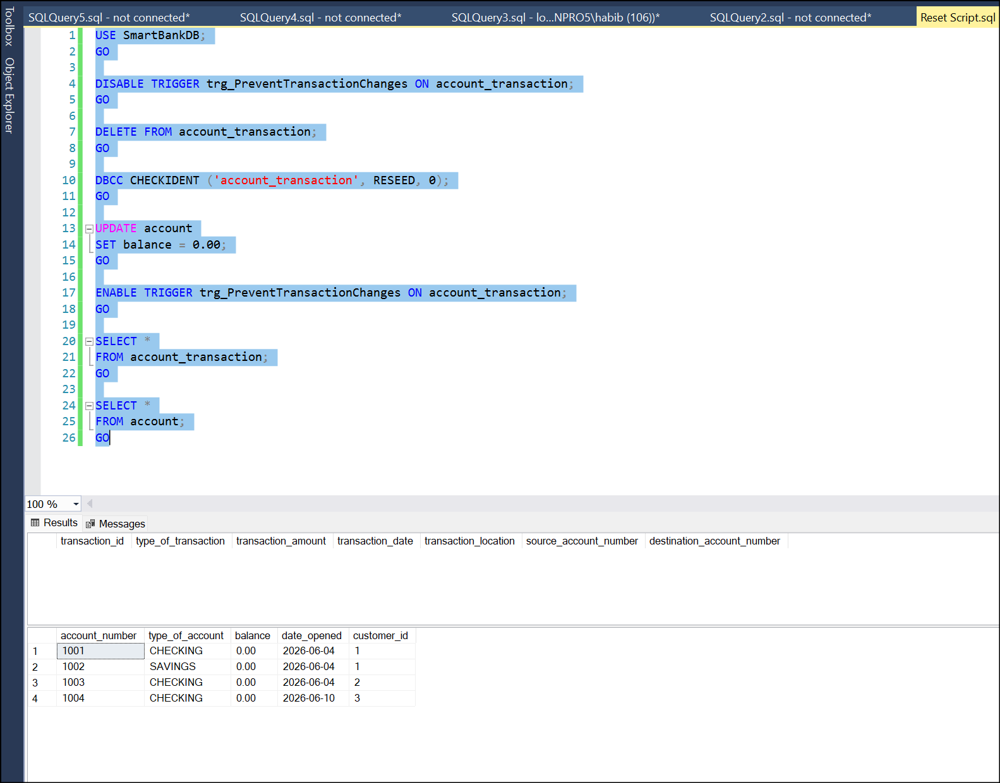

### Successful Customer Creation

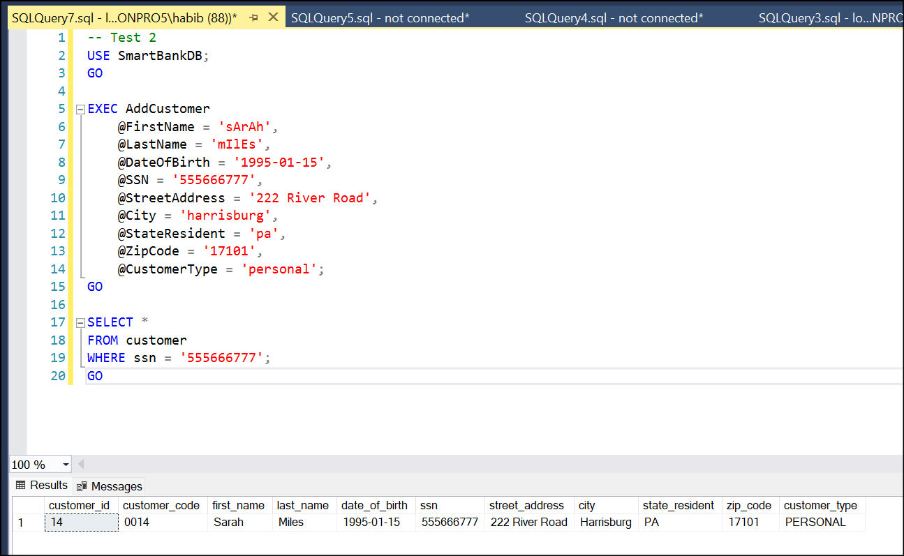

### Failed Duplicate Customer Creation

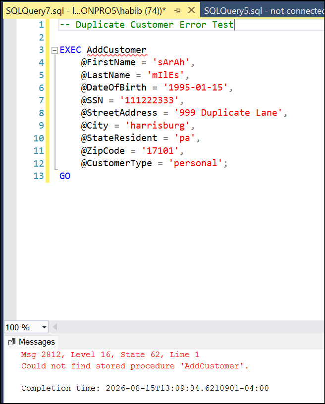

### Successful Account Creation

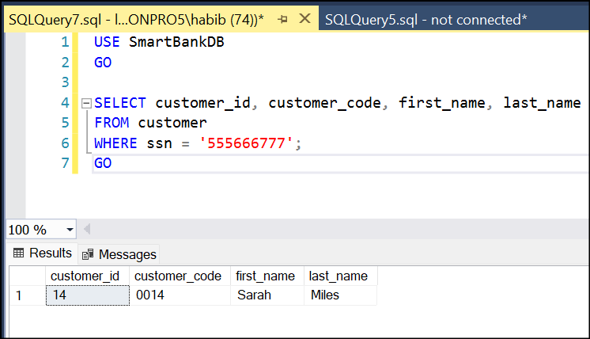

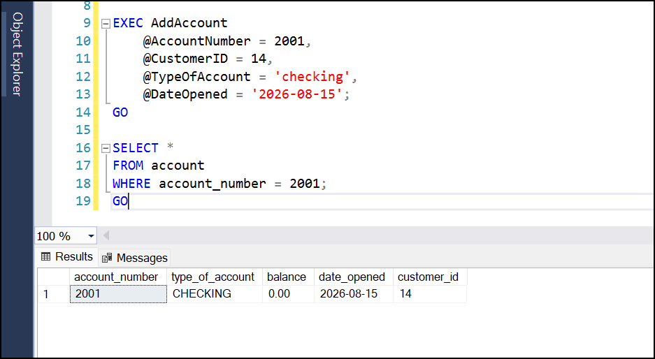

### Failed Account Creation

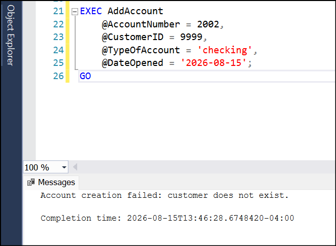

### Successful Deposit

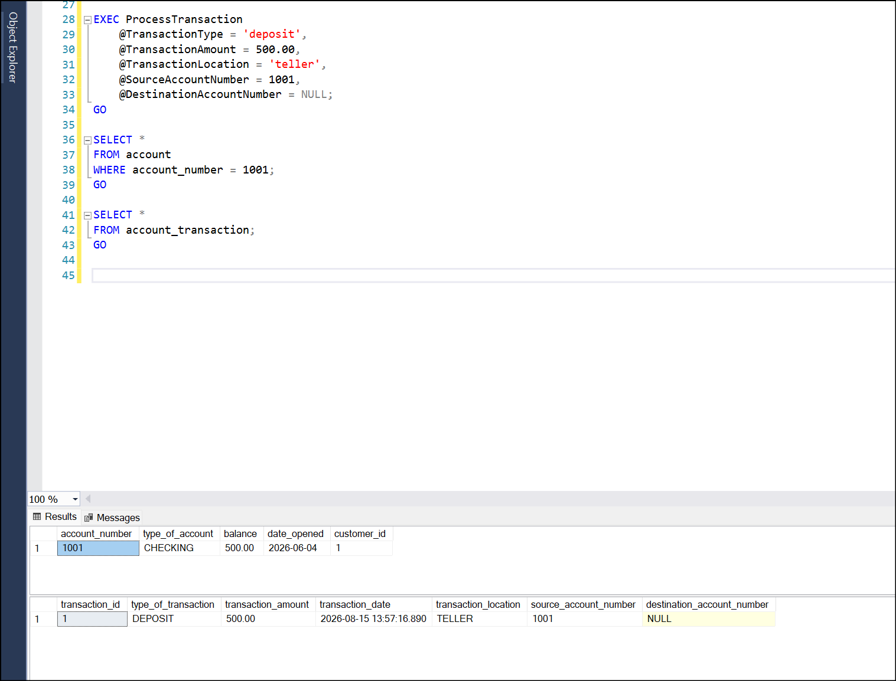

### Successful Withdrawal

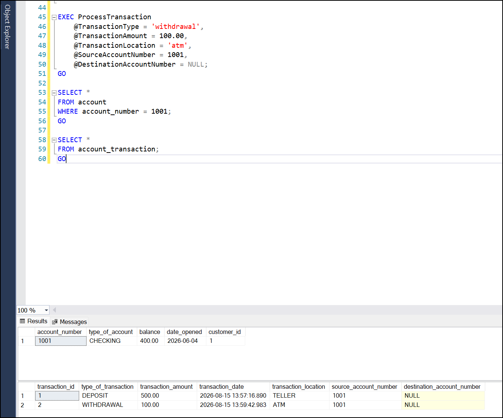

### Successful Transfer

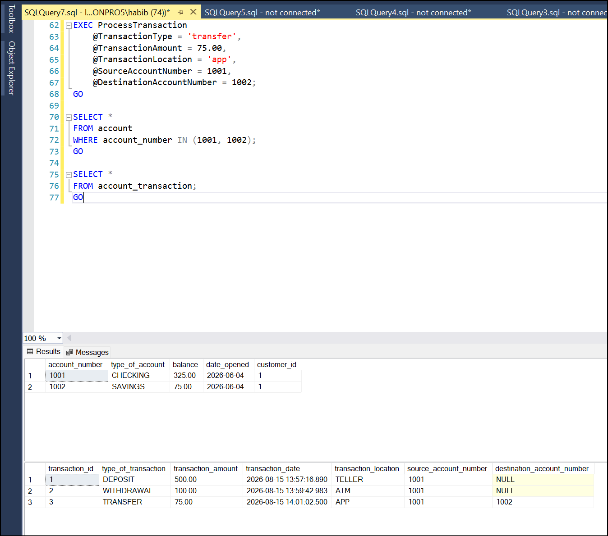

### Failed Insufficient Funds Transaction

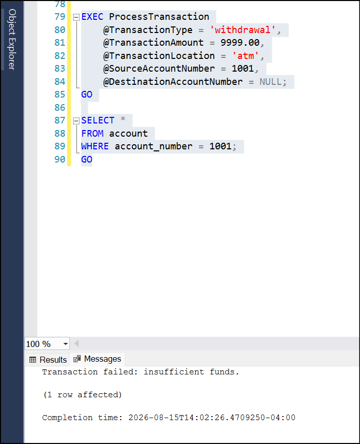

### Failed Transaction Update

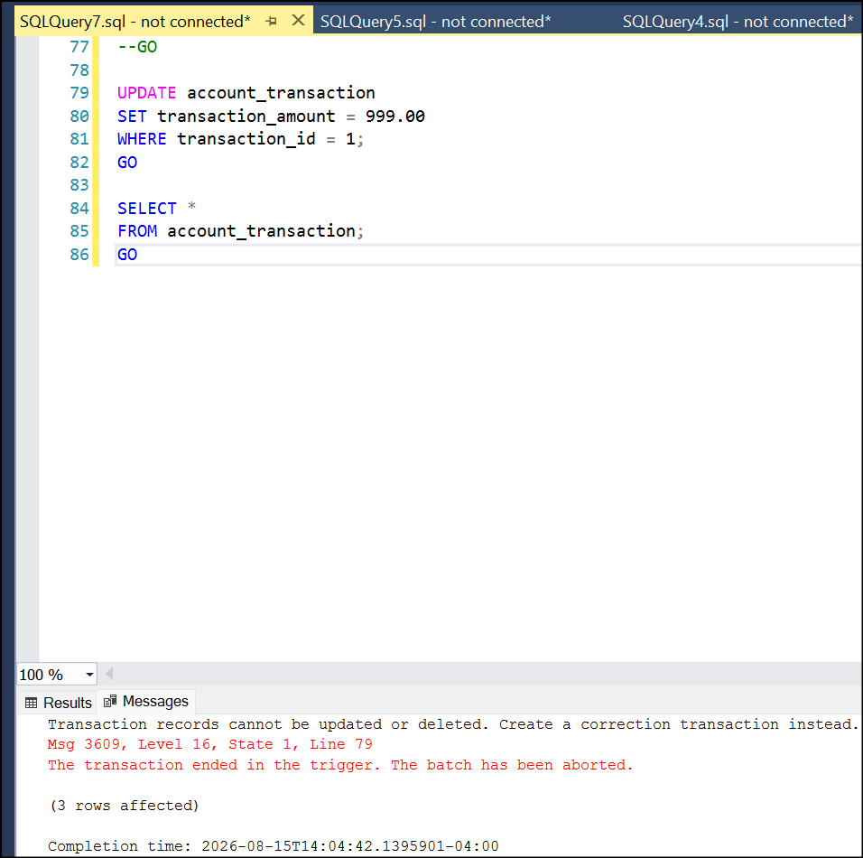

### Final Account and Transaction Summary

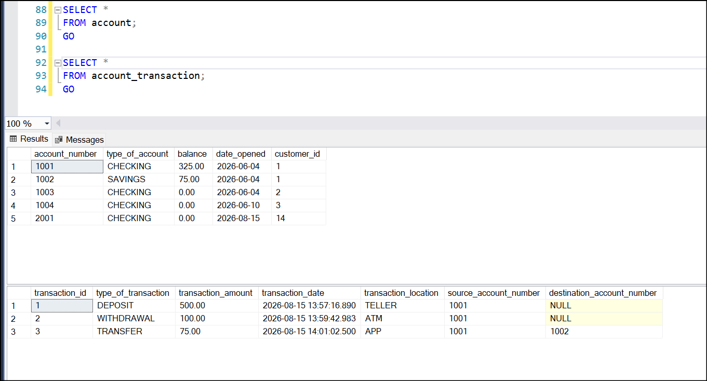

## Skills Demonstrated

This project demonstrates hands-on experience with:

- Relational database design
- SQL Server database creation
- T-SQL table creation
- Primary keys and foreign keys
- Check constraints
- Unique constraints
- Default constraints
- Computed columns
- Data validation
- Stored procedures
- Triggers
- Transaction processing
- Balance automation
- Audit protection logic
- Testing successful and failed database operations
- GitHub project documentation

## Portfolio Purpose

This project is intended to demonstrate practical SQL Server skills for entry-level database, data analyst, technical support, and IT/business systems roles. It shows the ability to design a structured relational database, enforce business rules, automate account balance updates, validate data, protect transaction history, and document a technical project clearly.

## Future Improvements

Potential improvements for a more production-like version include:

- Automatic account number generation
- Reversal transaction logic instead of deleting test transactions
- Audit logging for administrative actions
- More advanced transaction locking for simultaneous withdrawals and transfers
- Additional reporting queries for customer balances and transaction history
- An ERD diagram showing table relationships
